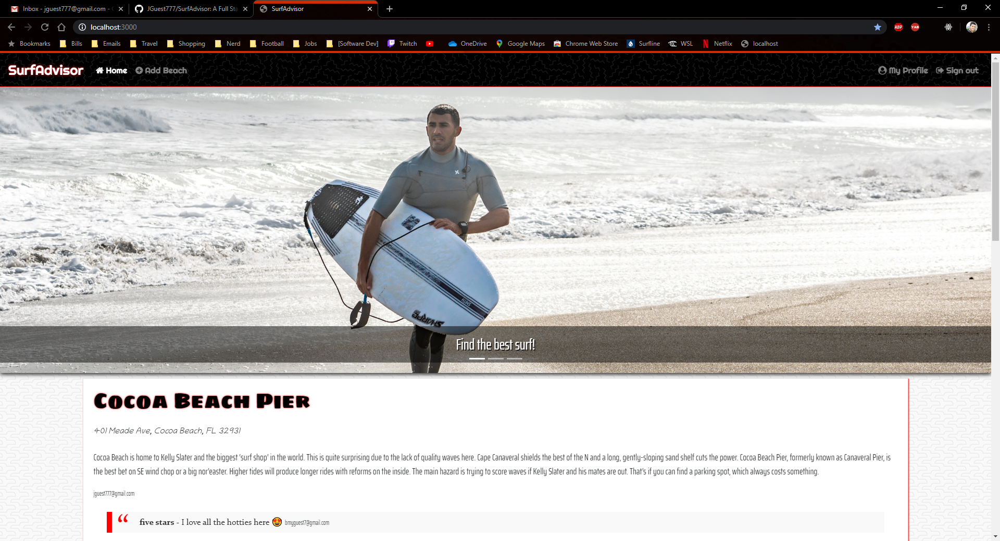
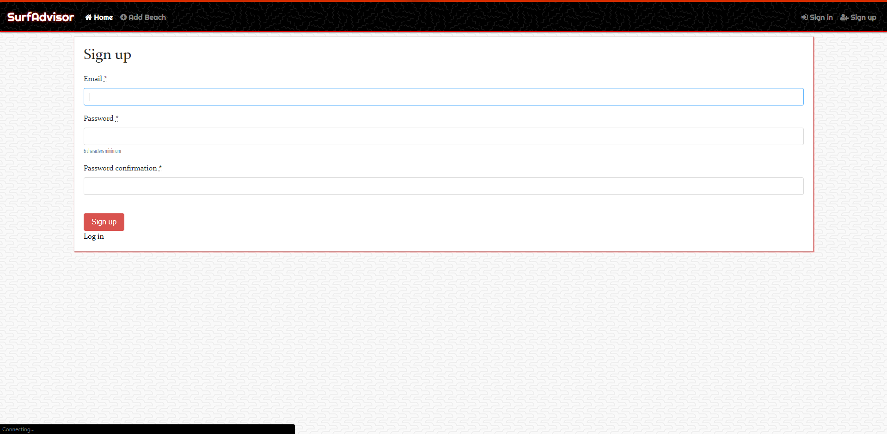

# SurfAdvisor

A Yelp clone that integrates with the Google Maps API and includes features like user comments, star ratings, image uploading, and user authentication.

## Uploading

 

## Authentication

 

## Comments/Ratings

## Deployment

* [https://surfadvisor-app.herokuapp.com/](https://surfadvisor-app.herokuapp.com/)

## Tech

* [Ruby](https://www.ruby-lang.org/en/documentation/) v: 2.5.3
* [Rails](https://rubyonrails.org/) - v: 5.2.3
* [Bootstrap](https://getbootstrap.com/docs/4.4/getting-started/introduction/) - v: 4.0.0.alpha6
* [jQuery](https://jqueryui.com/download/) - v: jQuery-rails
* [postgreSQL](https://www.postgresql.org/) - Database
* [Heroku](https://devcenter.heroku.com/) - Deployment

## Built With

* [Geocoder](https://github.com/alexreisner/geocoder) - Geocoding solution for Ruby.
* [Carrierwave](https://github.com/carrierwaveuploader/carrierwave) - File uploads
